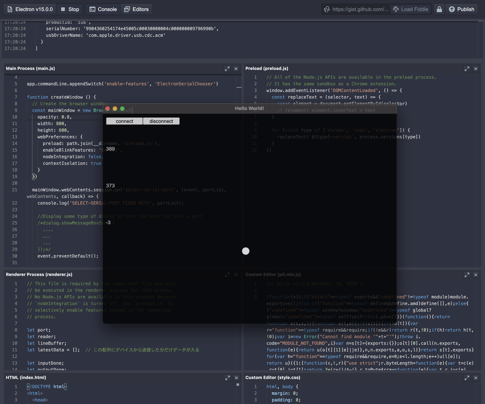

# Electron Fiddle + p5js + WebSerialAPI + micro:bit

<a href = "https://www.electronjs.org/fiddle">Electron Fiddle</a>をつかって、シリアル通信アプリケーション（試作）をつくりました。Electron v15で動作確認しています。シリアル通信には、WebSerialAPIをつかっていて、micro:bitのusbVendorIdとusbProductIdをフィルタして、micro:bitにのみ接続するようにしています。

</img>

## micro:bitのテストプログラム

https://makecode.microbit.org/_Uf3KRD5mUTxc

</img>

## 参考

WebSerialAPIについて

https://codelabs.developers.google.com/codelabs/web-serial#2

ElectronとWebSerialAPIについて

https://gist.github.com/jkleinsc/284893c7f01d3cb4559508ca06919481#file-main-js-L21

